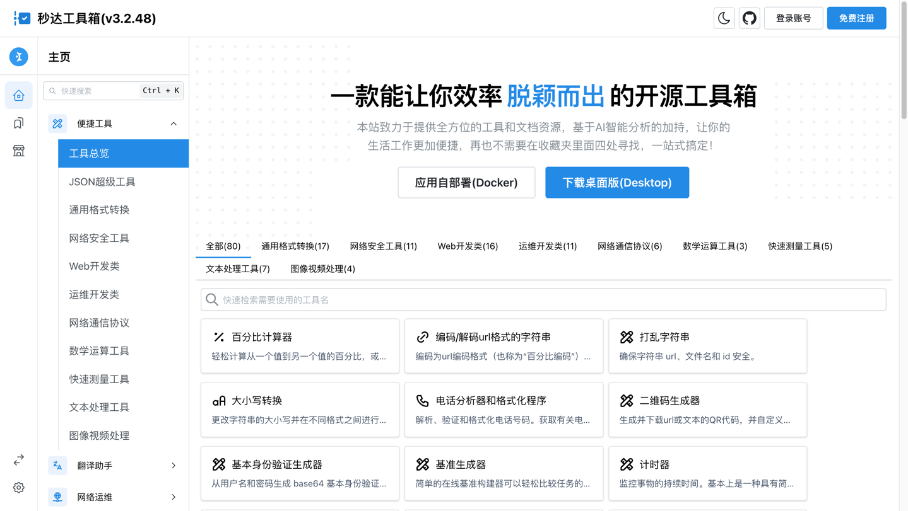

<p align="center">

<br>
<span style="font-size:20px">秒达工具箱 -- 免费安全的一键式呼出工具箱
</span>
<br><br>
</p>

# 🔮 一句话介绍

秒达工具箱是一款隐私优先，可自部署且完全开源的中文工具箱！

# 💌 特征

- 永远的自由软件
- 轻量级运行时
- 全平台支持（包括ARMv8）
- 完全类似 GPT 的支持
- 与高效的 UI 高度集成
- 可用的 Docker 映像和便携式版本
- 桌面版支持(Planning)
- ...

# 🚀 在 Docker 上运行


```
docker run -e LAFREGION=CN -e APPLANG=zh_CN --name mylaftools -v ~/.laftools-docker:/root/.laftools -d -p 0.0.0.0:39899:39899 codegentoolbox/laftools-linux-x64:latest
```

**NOTE**:

1. 默认端口设置为39899，您可以根据需要进行调整。
2. 秒达工具箱将始终自动升级到最新版本，让您可以享受最新的功能和错误修复。

**Docker Images:**

- [Docker Hub - laftools-linux-x64](https://hub.docker.com/r/codegentoolbox/laftools-linux-x64)
- [Docker Hub - laftools-arm64-x64](https://hub.docker.com/r/codegentoolbox/laftools-arm64-x64)

# 🔗 在线网站

为了快速使用这些功能，我们部署了稳定的在线网站供您使用。除了一些依赖特定操作系统功能的工具外，大多数工具都可以在我们的在线网站上找到。

- 🇨🇳 国内版: [mdgjx.com](https://mdgjx.com)

# 🌠 项目规划

[x] 桌面端应用       
[x] Docker版本  
[x] 移动端兼容    
[x] it-tools集成+汉化    
[x] 多类型翻译  
[] 插件化设计    
[] Spotlight   
....





# 🌠 贡献

## 1. 设置系统环境

为了简单起见，假设您已将此仓库克隆到 Windows 上的 `C:\Usersjerry\project\laftools-repo` 或 Linux/MacOS 上的 `/Users/jerry/projects/laftools-repo`，那么您应该在文件 **~/.bashrc* 中声明 env 并在下面设置配置*，或者只是在运行任何命令之前执行它们。

如果您使用的是 Windows 操作系统，请确保所有命令都在 git-bash 中执行，了解更多信息请参阅 [贡献](/docs/zh_CN/CONTRIBUTION.md)。除此之外，建议避免在该项目所在的文件路径中使用任何空格或非英文字符。

**Env for Windows:**

```bash
git config core.ignorecase false
export MDGJX_ROOT="C:\users\jerry\project\laftools-repo"
export PATH=$PATH:$MDGJX_ROOT\dev\source\windows-bin
```

**Env for Linux/MacOS:**

> 如您遇到permission denied问题请在命令前加sudo赋予更高权限

```bash
export MDGJX_ROOT=/users/jerry/projects/laftools-repo
```

## 2. 编译并运行

```bash
# 安装所需的全局库
npm i -g pnpm ts-node typescript

# 安装项目依赖
cd $MDGJX_ROOT && npm install -S -D --force
cd $MDGJX_ROOT/modules/web2 && npm install -S -D --force
cd $MDGJX_ROOT/devtools/scripts/scan && npm install -S -D --force

# 运行核心服务
npm run fe-web

```

## 3. 构建(Build)

```bash
cd pipeline
./build-all.sh
```

# 📑 其他材料

如果您想了解有关该项目的更多详细信息，可以查看以下更多材料：

- [常见问题](/docs/zh_CN/FAQ.md)
- [贡献](/docs/zh_CN/CONTRIBUTION.md)
- [对于中国开发者](/devtools/notes/common/issues.md)

# 💐 Icons

我们非常感谢提供以下精美图标的才华横溢的艺术家：
<a href="https://www.flaticon.com/free-icons/ide" title="ide icons">Ide icons created by umartvurdu - Flaticon</a>
<a href="https://www.flaticon.com/free-icons/ide" title="ide icons">Ide icons created by heisenberg_jr - Flaticon</a>
<a href="https://www.flaticon.com/free-icons/fund" title="fund icons">Fund icons created by Freepik - Flaticon</a>
<a href="https://www.flaticon.com/free-icons/translate" title="translate icons">Translate icons created by Freepik - Flaticon</a>
<a href="https://www.flaticon.com/free-icons/to-do" title="to do icons">To do icons created by Freepik - Flaticon</a>
<a href="https://www.flaticon.com/free-icons/timer" title="timer icons">Timer icons created by Freepik - Flaticon</a>
<a href="https://www.flaticon.com/free-icons/dictionary" title="dictionary icons">Dictionary icons created by Freepik - Flaticon</a>

# 🙏 致谢

如果没有出色的开源项目，这个项目就不可能实现，我想亲自向以下项目表示最深切的谢意：

1. [Blueprint UI](https://blueprintjs.com/) - a React-based UI toolkit.
2. [CyberChef](https://github.com/gchq/CyberChef/tree/master) - a web app for encryption, encoding, compression and data analysis.
3. [Lodash](https://github.com/lodash/lodash) - a modern JavaScript utility library delivering modularity, performance, & extras.
4. [one-api](https://github.com/songquanpeng/one-api) - an OpenAI key management & redistribution system.

当然，还有其他开源项目受益并促进了这个项目，我无法在这一部分中详细介绍；如果没有这些项目和这些人才开发人员的努力，秒达工具箱就不可能实现。

# 🪪 License

该项目受 GNU Affero 通用公共许可证保护，请参阅许可证文件了解更多详细信息。
